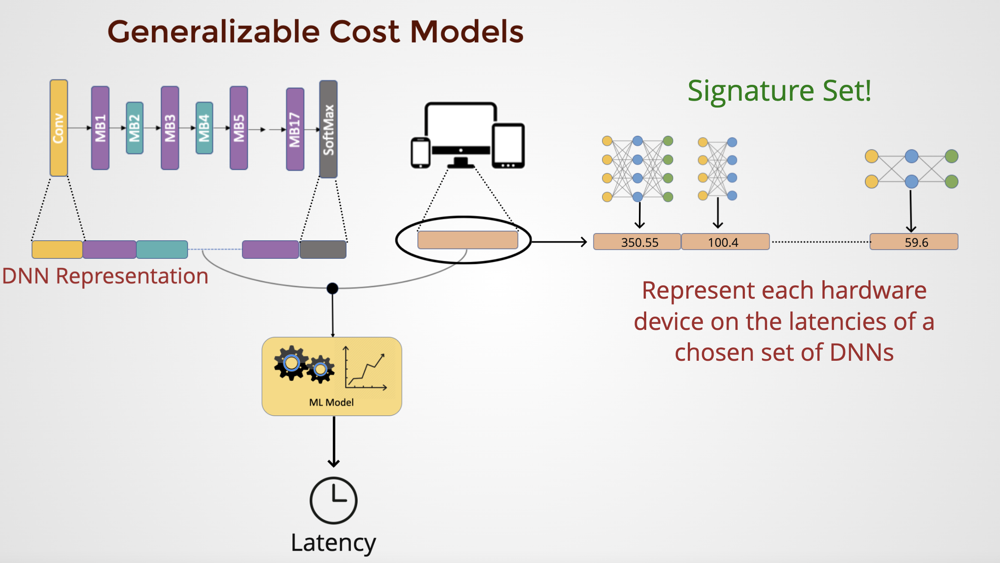
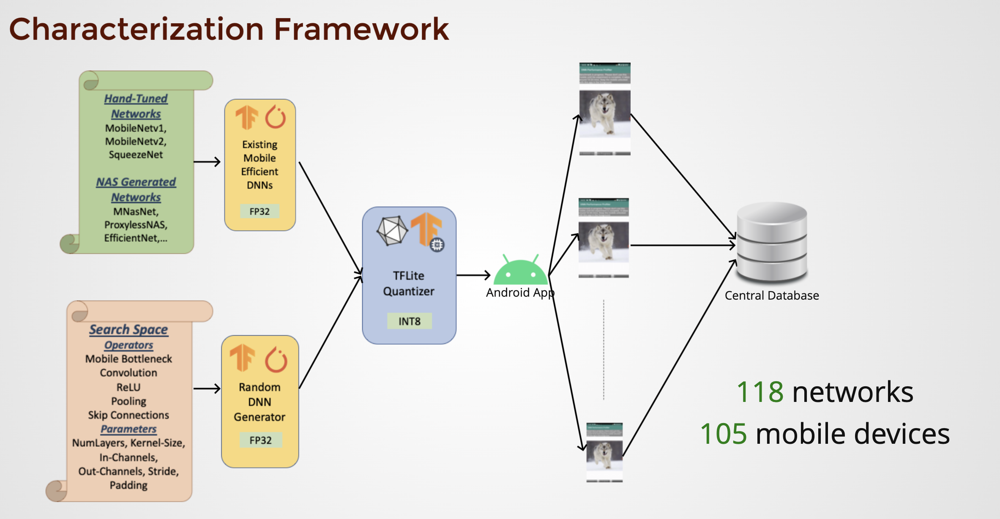
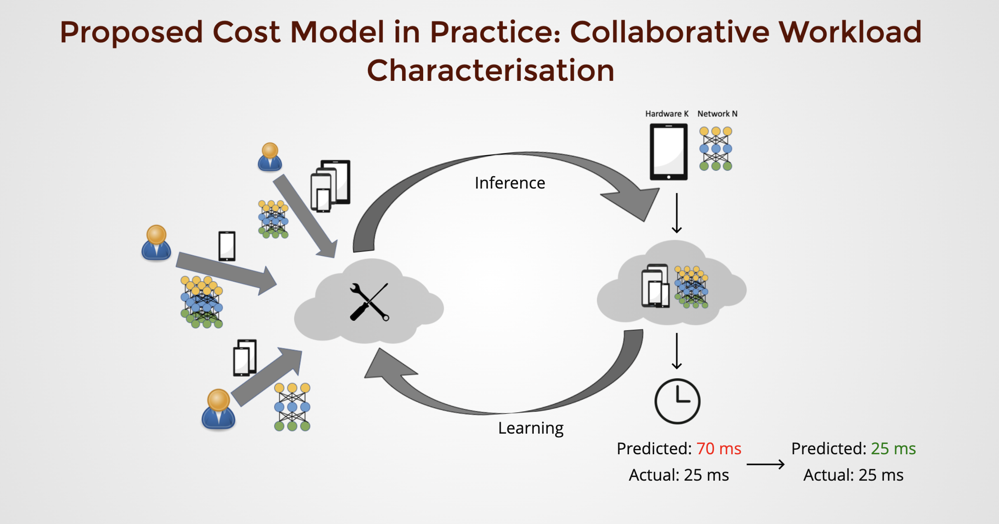
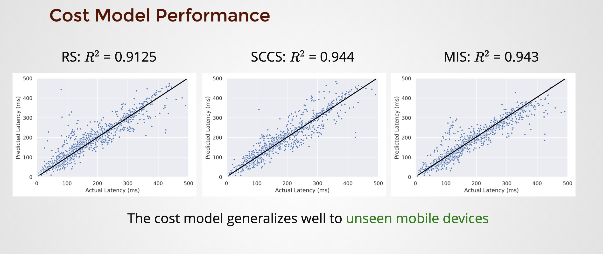
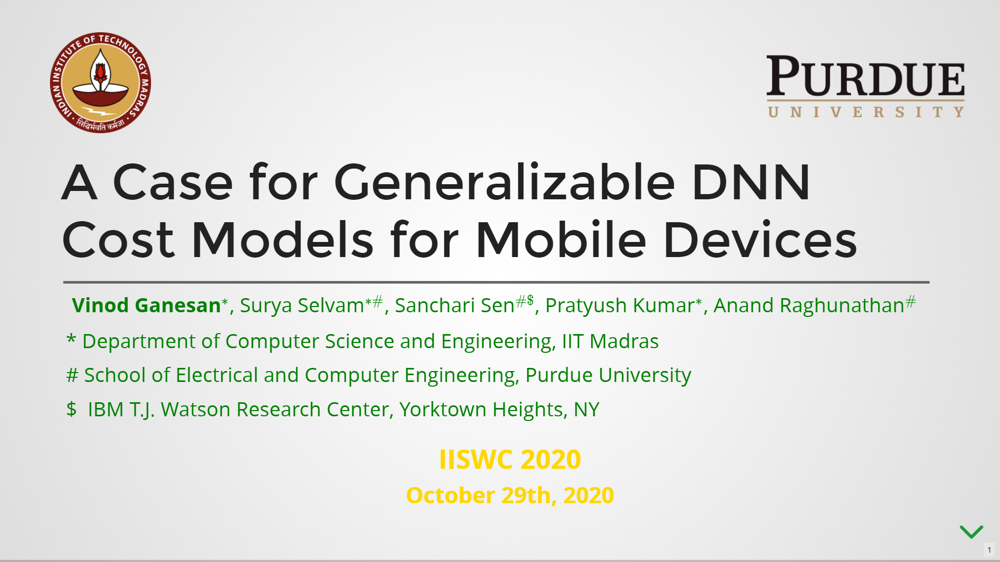

# A Case for Generalizable DNN Cost Models for Mobile Devices [[Paper](https://vinodganesan.github.io/files/Generalizable_DNN_Cost_Models_IISWC_2020.pdf)][[Slides](https://slides.com/pratyushkumarpanda/deck/fullscreen?token=QQC26kZT)][[Videos](https://youtu.be/Mh1c-tNWRoc)]

```BibTex
@inproceedings{ganesan2020case,
  title={A Case for Generalizable DNN Cost Models for Mobile Devices},
  author={Ganesan, Vinod and Selvam, Surya and Sen, Sanchari and Kumar, Pratyush and Raghunathan, Anand},
  booktitle={2020 IEEE International Symposium on Workload Characterization (IISWC)},
  pages={169--180},
  year={2020},
  organization={IEEE}
}
```
## Desigining generalizable cost model for many devices


## Characterisation Framework


## Use case: Collaborative Workload Characterization


## Results


## How to use our generalizable cost model?

* Generate random efficient networks and generate tflite models.

```bash
cd char_framework/net_generator/mobileOptGen
python MobileGen.py
```
* Deploy the generated tflite models on Android and measure the inference latency.

The android app is derived from the basic [pytorch-demo-app](https://github.com/pytorch/android-demo-app/tree/master/PyTorchDemoApp), with custom enhancements and the integration of [tflite-runtime](https://www.tensorflow.org/lite/guide/inference). You can follow the steps provided by PyTorch to build the app. More details on tweaking the app to generate inference time soon. 


* Learning a Cost Model
```bash
cd cost_model
python gen_cost_models.py --sampling_type SAMPLE --learning_type LEARN  --name NAME  --numSamples SAMPLE --model MODEL 
```
* Command line options

**--sampling\_type** (required): The sampling type required for choosing the Signature Set. "random", "mutual\_info", "spearmanCorr", and "statistical" are valid choices. 

**--learning_type** (required): The way in which the cost model is trained. "individual", "combined", and "collaborative" are valid choices. 

**--name** (required): Name of the run.

**--numSamples** (required): Number of samples used to form the Signature Set. 

**--model** (required): The cost model used. "xgb" and "lstm" are valid choices. 


## Requirements

* Python 3+
* XGBoost
* Tensorflow 2+
* PyTorch
* ONNX
* torchprofile
* Android Studio (For measuring inference latency) 

## Slides
[](https://slides.com/pratyushkumarpanda/deck/fullscreen?token=QQC26kZT)

## Short Video
[](https://youtu.be/fOcvznSENUU)

## Full Video
[](https://youtu.be/Mh1c-tNWRoc)
